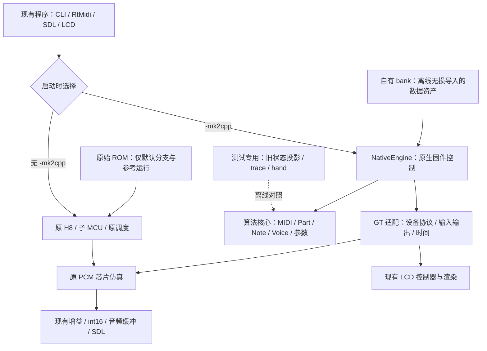

# M4.5 施工架构：原生固件核心与 GT 设备适配

状态：**设计基线，未实现、未验收**。2026-09-13，代码检查基点 `f9dfe75`。
目标依据 [13](13_m45_native_reconstruction.md)，施工顺序与首个切片见
[15 施工规程](15_m45_construction_guide.md)。本文中的类型、目录和 API 均为拟定接口。
透明 WAV 资产与替换播放的进一步要求见 [16](16_transparent_bank.md)。

## 0. 架构决策

**在同一 Nuked SC-55 程序内增加原生固件控制后端，保留原 PCM 芯片仿真及宿主设施。**
`-mk2cpp` 最终选择原生后端；不加 flag 继续原模拟器。M4 的 gen/hand 保留为参考工具。

| 决策 | 实施含义 |
|---|---|
| 核心以合成器概念组织 | MIDI、Part、音色、Note、Voice、控制更新与设备操作，而非 ROM 页面/函数地址 |
| 原生状态只由原生核心持有 | 旧 SRAM 不是原生运行时数据库；字段原地址属于对照资料 |
| PCM 保留声音基础 | 原厂路径保留原实现与读取副作用；用户 WAV 仅扩展采样源接缝，复用原滤波/包络/混音/效果，见 16 |
| 原生运行零原 ROM 依赖 | 离线导入原素材生成自有 bank；原生启动、播放、复位与恢复只使用 bank，不读取原 ROM 文件或固件映像 |
| bank 是透明可编辑资产 | 标准 WAV + 公开的采样/音色定义；编辑后必须实际使用新素材，原厂兼容数据不能作为隐藏回退 |
| 时间也是兼容行为 | 用有证据的设备事件、任务阶段及延迟表达；不凭听感随意移动更新时刻 |
| 参考代码隔离 | 原生核心不能链接 H8/SM 指令执行、gen/hand 或旧状态导入器 |
| 实施从完整小算法开始 | 先证明一个算法与边界，再扩展调用链；不先生成数千个有业务名字的指令包装 |
| 沿用 C++11 和现有依赖 | 当前 CMake 为 C++11；不引入框架、ECS、通用消息总线或新音频库 |

以下是**已经看到的约束**，不是待实现架构的完成证据：

- `MK2CPP_Step()` 目前仍按 PC 选择 hand、gen 或解释器。
- `PCM_Read()` 会提交 pending mask；读取 IRQ 状态可清中断；PCM 的一条 IRQ 锁存
  不等于可以无限追加的 voice 完成事件队列。
- PCM 直接调用 MCU 中的样本输出与 IRQ 函数；音频采集使用 `mcu.cycles`。
- RtMidi、Win32 MIDI、面板键盘和 schedule 注入需共同审计，不能只接通一个输入来源。
- 旧 pool 研究有字段勘误和未决项；不能把旧 `Pool` 草案直接换成 class 就称为原生模型。

## 1. 三层依赖与部署位置



依赖只能由外向内。核心包含标准库和本工程语义头文件，不能包含 `mcu.h`、
`mcu_opcodes.h`、`submcu.h`、`pcm.h` 或 SDL/RtMidi 头文件。PCM 设备对象只在适配层可见。
测试可以同时了解两种表示，生产核心不能反向依赖测试适配。

建议目录如下，**按切片创建实际用到的文件，不预建空模块树**：

```text
mk2cpp/src/native/
  core/
    ids.h / state.h             有含义的标识与状态
    free_voice_queue.*          空闲队列的真实顺序与操作
    voice_allocator.*          原分配/抢音策略
    note_engine.*              音符配对、描述符及 voice 关系
    part_control.*             GS/控制器/音色与 part 状态
    voice_control.*            固件侧音高、包络/调制参数计算
    tone_catalog.*             类型化音色/参数表访问
    midi_decoder.*             字节流解析
    panel_control.*            固件的面板与显示逻辑
  runtime/
    native_engine.*            调用编排，不吞并上述算法
    control_scheduler.*        时间、任务优先级、可观察阶段
    device_ports.h             核心之外的设备契约
    voice_programmer.*         参数/命令到 PCM 操作的编排
  adapters/
    gt_pcm_port.*              唯一的原生 PCM 协议接入
    gt_host_port.*             现有输入、LCD、输出与时钟接线
    bank_loader.*              bank 校验/类型化数据装载，不解析原固件映像
    wav_sample_source.*        用户 WAV 的播放状态与采样源，接入边界见 16
    native_snapshot.*          原生后端保存恢复
mk2cpp/tests/native/            拟新增：原生算法与运行时测试
mk2cpp/tests/reference/         拟新增：旧状态投影、局部执行与差分
mk2cpp/tools/bank_import/       拟新增：离线 ROM 数据解析与 bank 导出
mk2cpp/src/hand/                保留 M4 检查点
```

构建至少分为 `mk2cpp_native_core` 与 GT 接入目标。核心测试用明确的输入/记录型假设备
运行，链接依赖中没有 MCU 执行器。GT 接入与参考测试可以链接原项目。
测试二进制仅是测试工具，不是新增产品。M4.5 原生生产路径不得依赖本地 `src/gen/`。

## 2. 状态模型：先恢复关系，再选择布局

状态统一由 worker 线程上的 `NativeEngine` 持有；算法可以通过显式引用修改其负责的
一部分。不要为每个字段增加 getter/setter，也不要把所有状态塞入一个可任意写的全局单例。

| 状态/模块 | 唯一职责与权威数据 | 不能混入 |
|---|---|---|
| `MidiDecoder` | running status、未完成消息、SysEx 接收状态 | MIDI 端口或 H8 UART 寄存器 |
| `PartState` / `PartControl` | part 配置、控制器、程序/音色选择、part 级分配参数 | PCM 滤波反馈状态 |
| `NoteState` / `NoteEngine` | 重复同音配对、键与踏板状态、原描述符关系、所属 voice 集合 | 用 MIDI key 唯一标识所有实例 |
| `VoiceAllocationState` / `VoiceAllocator` | 空闲队列、归属、分配顺序、抢音优先级 | 声音波形推进或 PCM 总线读写 |
| `VoiceControlState` / `VoiceControl` | 固件侧 pitch/调制/控制包络与待提交参数 | 重复计算 PCM 内部已有的包络/滤波算法 |
| `ControlScheduler` | 逻辑时间、任务就绪/等待、事件优先级、下一期限 | PC、H8 寄存器、模拟指令栈 |
| `VoiceProgrammer` | 待完成的设备操作、参数快照、已提交值缓存 | 另一个权威 voice 池或另一个 PCM |
| `GtPcmPort` 背后的现有 `pcm` | 芯片 RAM、latch、mask、IRQ、滤波/效果及原厂采样状态；自定义 WAV 源状态归适配层并一并保存 | 原生音符分配策略 |
| `PanelState` / 现有 LCD 状态 | 前者为固件界面逻辑，后者为 LCD 控制器/字符与渲染状态 | 新画一套替代 LCD 的界面 |

### 2.1 标识、数量和数值

- `VoiceId`、`DescriptorId`、`PartId`、`PcmSlot` 使用不同的类型；不要以任意整数
  在四种索引域间隐式转换。可以是含一个整数的轻量 struct，兼容 C++11。
- `VoiceId`/`DescriptorId` 可以使用 `uint16_t`，无效值独立定义为 `0xffff`。
  旧 `0xff`、符号位与地址缩放只在 ROM/参考适配转换。业务计数使用足够宽的无符号
  类型，有符号短缺量保持有符号，不能将所有数值一起 unsigned 化。
- stock 28 的 voice/描述符容量与 16 个 part 分别声明。M5 不得靠修改一个 `N` 隐式
  改掉所有表；是否需要增加某张表，要从所有读写者和语义确认。
- 数值位宽和 ID 容量是不同问题。pitch、系数、原定点累加的截断规则逐项保留。
  算术 helper 应命名为它计算的数值操作，不以 `ADD_R1_R2`、SR flag 或 opcode 命名。
- 正常播放中使用稳定索引和预分配存储，不以宿主指针作为可保存的对象身份。
  M4.5 只运行 28 容量，ID 预留宽度不等于提前实现 M5。

### 2.2 避免“漂亮但错误”的模型

**池中可用、控制命令状态、PCM 实际发声状态必须分别表达。** 旧 release 路径包含
安排停止命令和返回空闲链等多步动作。不能先假定 `Free/Playing/Releasing` 一个枚举
就覆盖所有状态，也不能擅自改为“硬件停止后才允许回收”，改变原有重用顺序。

原始描述符、MIDI Note On 实例与 PCM voice 不预设一一对应。先证明重复音符、双 voice
音色、踏板与抢音的对应关系；`NoteId` 若作为新的逻辑实例标识，必须写出它与原描述符
生命周期的映射。字段未知时不填一个听起来合理的 `age`/`priority` 含义。

`VoiceProgrammer` 的参数缓存只是已提交/待提交值的镜像，不能与算法状态双向覆盖。
例如 committed pitch 不能被当作目标 pitch 的权威输入，除非原算法就是读回设备值。

## 3. API 的形状与调用关系

以下只固定**职责、数据流和副作用边界**，不声称已经恢复所有 MK2 算法。不要直接
生成这些空函数再登记完成；每个实际函数必须附有 [15](15_m45_construction_guide.md) 的算法契约。

| 操作示例 | 输入 → 输出/副作用 | 负责模块 |
|---|---|---|
| `decodeByte(byte, availableAt)` | 连续字节 → 完整消息或更新解析状态 | `MidiDecoder` |
| `applyControl(message, part)` | 控制消息 → 原固件对应的参数变化/后续工作 | `PartControl` |
| `resolveTone(part, key, velocity)` | 音色选择条件 → 只读的音色层/参数视图 | `ToneCatalog` |
| `startNote(request)` | 原配对/分配规则 → 描述符与 voice 归属、参数准备 | `NoteEngine` |
| `selectVoices(request, state)` | 需要的 voice 数与 part 状态 → 原选择/抢音结果 | `VoiceAllocator` |
| `releaseNote(request)` | Note Off/踏板/原音符关联 → 原释放动作 | `NoteEngine` |
| `updateVoiceControl(voice, tick)` | 上次状态、参数与时间 → 下一控制状态/待提交值 | `VoiceControl` |
| `servicePcmSignal(tick)` | 芯片 IRQ 锁存 → 原固件的确认与后续任务 | runtime + `GtPcmPort` |
| `publishPanelChanges()` | 固件显示状态 → 原 LCD 命令/数据 | panel + host adapter |

主体必须能读出原算法。`startNote()` 不能只是调 `step_...` 的名单；
`selectVoices()` 也不能随意换成现代合成器常见的“最旧声部优先”。

跨模块只传必要状态、结果或有业务含义的待办操作。优先普通函数与结构体，只有
真实设备/宿主边界才需要 port；不为每个算法创建抽象基类。不要通过一个可任意读写的
`MemoryBus` 或通用微指令 `Operation` 绕过边界。

### 3.1 一条音符路径应该如何被读懂

1. 输入字节按已恢复的接收时序到达；解析完整消息，处理 running status 等协议状态。
2. 处理消息时按原顺序读取 part/音色参数，建立原算法需要的 note/描述符关系。
3. 计算所需 voice，按原空闲链/抢音规则取得资源；保留不足时的原行为及多 voice
   分配是否可部分成功，不能自造事务回滚政策。
4. 计算固件侧参数，安排有明确生效时刻的 PCM 操作；不从输入回调直接写 PCM。
5. PCM 按原芯片算法发声；控制周期与 IRQ 触发后续更新/结束处理。
6. Note Off、踏板和结束事件分别走其原有规则，更新关联、控制命令及资源状态。

这是一份阅读导航。各步内的真实次序、可打断点和计算公式必须由对应契约补齐。

## 4. PCM 适配：保留芯片，恢复控制协议

`GtPcmPort` 是 native 运行路径中唯一允许访问 `PCM_*`/`pcm_t` 的模块。
`VoiceProgrammer` 组织原生参数与设备操作，业务核心看不到 `ram1[slot][n]`。
`NativeSnapshot` 通过此 port 保存/恢复 PCM 的设备状态，不另开直接读写内部 RAM 的入口；
参考测试的状态投影与诊断不属于生产控制协议。

建议将接口拆成以下明确操作，而不是一个带很多隐含副作用的 `updateVoice()`：

| 操作 | 契约 |
|---|---|
| 选择槽、写参数字段 | 编码成原有 PCM 寄存器序列；保留 write latch 和最后一个字节提交的规则 |
| 读取参数/状态 | 按原 read latch 协议读取，不直接用 `pcm.ram*` 替代读取 |
| 暂存 enable mask | 只执行原 pending 写操作 |
| 提交 enable mask | 显式执行原读触发的 latch 行为，与暂存分开 |
| 观察 IRQ / 确认 IRQ | 保留原 pending 与单槽锁存语义；确认调用必须显式可见 |
| 推进到设备服务时刻 | 使用既有 `PCM_Update()`，样本与 IRQ 送到已选后端的接收点 |

内部可以定义命名的 PCM 字段和真实总线读写操作，允许寄存器常量和必要字节编码。
这些操作只表达 PCM 协议，不得加入 H8 算术、PC 跳转或通用寄存器文件。

**不要自动合并、重排或缓存所有写操作。** 两次相同的值可能仍有 latch 副作用。
多字节写跨过芯片更新/中断可观察点时，必须保留相应操作边界；只有证明不可观察的
序列才可在一次调用内完成。读前选择槽、状态确认和 mask 提交都列入测试。

IRQ 桥的回调只记录芯片线状态/发生时间，不在 `PCM_Update()` 内重入 NoteEngine。
`pcm.irq_assert` 已占用时，不能由适配层额外合成被原芯片锁存规则抑制的 IRQ。
也不能把每次 IRQ 无条件解释成“音符已经结束”；原固件对事件的意义由控制算法决定。

设备 readback、槽选择与当前槽号保留在一个明确的 port 实例中。M4.5 可继续使用原
进程全局 `pcm`，每次运行只选一个后端；不要求为了架构整洁复制两颗 PCM 或重写源码。

## 5. 时间模型：原生算法同样要有可证明的时序

### 5.1 三种时间和边界语义

- `Tick`：64 位单调逻辑时间，第一版沿用现有测试的主时间单位，便于对照。
- `PcmServiceTime`：将原生 Tick 映射到既有 `PCM_Update(cycles)` 的服务时刻。
  其内部 `pcm.cycles` 可能越过传入值，不能把两者当作同一个计数器。
- wall time：仅用于音频缓冲节流和性能测量，不参与固件算法或离线事件排序。

调度键采用 `(tick, phase, sequence)`。`phase` 的顺序来自所选 GT 配置的事件顺序，
`sequence` 只稳定原有因果顺序，不能随意替代原任务优先级。`advanceTo(limit)` 的契约
建议为处理所有 `tick < limit` 的事件，等于 limit 的事件留待下一步；设备端另行适配
`PCM_Update` 的严格 `<` 循环，不能直接混用两种边界。

### 5.2 现有源码给出的重要限制

GT 当前在一次主循环中依次做中断/指令、主时间 `+12`、MIDI schedule 轮询、PCM、
timer、SM。下一次控制执行可能仍使用同一个数值 tick。因此“同 tick MIDI、PCM、
timer、控制谁先”必须有 phase 定义，不能按 C++ 模块排列顺序决定。

`PCM_Update()` 在入口计算 `reg_slots` 与 `voice_active`，然后循环推进芯片。
一次跨很长时间的调用可能冻结这些入口值、合并 IRQ 可观察时刻，并让采集输出共用
错误的 host 时间。**不能直接按 SDL 音频块大小一次推进全部 PCM，再处理控制事件。**

第一版按下一设备服务/控制期限推进，并在能触发 IRQ 或控制写的边界返回调度器。
可以保留经验证的设备服务网格，跳过没有事件的空档；这不需要执行或计数 CPU 指令。
旧 12-cycle 网格是否可以按 `pcm.cycles` 计算下一次机会，需要用边界用例验证；
不能把“每 12 cycles 什么都跑一次”重新变成永久的 MCU 调度循环。

### 5.3 原生任务与延迟

`ControlScheduler` 表达固件真正承担的任务：MIDI 服务、voice 控制更新、PCM 信号处理、
面板扫描、显示提交和已恢复的其他任务。不要把每个向量、trapa 或 ROM 基本块一对一
注册为 C++ task。已有 timer 模型在适配层可以复用；没有必要同时重写所有设备计时器。
但原生后端不能为驱动 timer 而继续执行 `SM_Update()` 内的指令循环。

每个任务契约至少含：触发条件、重复事件合并规则、优先级、周期与相位、读状态的
时刻、外部提交时刻、可打断阶段、恢复后所需状态。不能把所有任务简化为固定 1 kHz。

纯计算可在宿主立即求值，但结果在原逻辑时刻才提交。若中途事件能改变其输入或看到
部分写入，应拆成有业务含义的阶段并保存必要局部状态。只有证明不会影响共享状态和
输出的计算区间，才可用一个经过验证的延迟公式表达。

延迟公式可以按任务工作量和已确认的分支计算，必须附证据与适用范围；禁止由 asm
生成逐 PC 时间表、每个加法后 `advance(12)`，或在生产运行中重放参考 trace 的时间戳。
`phase=WaitForPcmCommit` 这类状态有明确外部原因；`resume_pc`、`instruction_index`
或按地址命名的数千个 continuation 是另一种指令机，不予验收。

### 5.4 先做时序调查，未知项不能由架构凭空补齐

目前不能从旧文档中直接认定以下参数已恢复：

| 必须补齐的契约 | 需要的证据 |
|---|---|
| 各控制任务的周期、相位和优先级 | 初始化/更新代码、实际事件序列；心跳计数不直接当频率 |
| MIDI 字节可用与固件消费时间 | RtMidi/schedule 入队、SM UART、主/子协作及消息消费链 |
| 声部命令计算与提交延迟 | 分支/循环依赖、PCM 写时间、可观察的中断穿插 |
| 同 tick 的跨设备顺序 | PCM IRQ、timer、SM/输入与控制读写的边界记录 |
| 启动和各类复位的生效时间 | 从 reset 开始的设备初始化与首个可服务输入时刻 |

无法建立上述契约时，该切片应标为“算法已恢复，时序未接入”，继续独立验证算法，
不可通过放宽 null、偷跑 H8 或伪造执行时间宣布原生运行完成。架构提供表达方法，
不保证未研究的固件时序已经可由少数公式精确表达。

## 6. 宿主接入与线程

### 6.1 入口切换

在现有主程序完成参数解析后、打开或强制检查任何原 ROM 文件之前确定后端。legacy
继续原 ROM 加载与初始化顺序；native 只装载 bank 并建立自身控制状态。
共享资源、PCM、SDL、LCD 的初始化继续复用，不能让公共启动前缀仍要求原 ROM 存在。
原生启动不能先运行 H8 到某个快照再接管；那只允许作为测试用的切片导入。

后端外层只需启动/复位、输入入队、推进、保存恢复、停止这些粗粒度操作。
可以用一个选定的 worker 函数或小型函数表；无需在每个业务函数内判断 flag。
原 `work_thread` 的指令部分留在 legacy 路径，原生路径调 NativeEngine。

开发期继续保留当前 `-mk2cpp` 的 M4 行为，原生切片先由测试入口运行；确需整程序
调试时，可增加明确的开发选择项并在启动日志写清模式。最终通过全部门禁后再把
`-mk2cpp` 切到 native。不得让半成品静默回退后仍显示“native”。
目标型号与资产版本由已验证的 bank 配置决定，不能对其他型号静默运行这套算法。

### 6.2 输入与输出

- **MIDI**：保留现有 RtMidi/Win32 MIDI 后端。所有输入来源在投递边界按后端路由，
  包括面板键盘、`MIDI_Reset`、schedule/测试注入。legacy 继续原 UART 路径。
  native 接收字节及到达顺序，后续用 InputTiming + MidiDecoder 恢复接收/消费语义。
  已含线速间隔的 schedule 不再盲目叠加一次 320 微秒；标清 ingress 与 available 时间。
- **多线程**：原生状态与 PCM 只在 worker 修改。MIDI 回调和 UI 只入队；它们可能是
  多个生产者，不可假设为单生产者队列。优先短临界区的预分配有界队列，锁在 host 层。
  满队列不得无声覆盖；离线输入可背压，实时输入的丢失/拒绝需显式记录，不能伪装等价。
- **LCD**：复用 `LCD_Write/Enable/Update` 与原字符/图形模型。固件的页面、键处理和
  显示更新由 PanelControl 恢复。保留现有锁的正确生命周期，避免改 worker 后
  `LCD_Update()` 仍试图锁一个未初始化的旧 mutex。
- **音频**：继续复用 `MCU_PostSample` 中的增益、int16 限幅和缓冲输出行为，必要时
  提取薄封装并保留 legacy wrapper。SDL callback 继续只消费缓冲，不运行合成器算法。
  在 worker 检查可用输出空间，避免长段推进覆盖未消费的样本。
- **采集**：给现有 audio tap 提供后端无关的采集时间。legacy 返回原 `mcu.cycles`；
  native 使用经过验证的对应服务时间/样本序号。不能为了兼容 tap 而把整个原生状态
  写回 mcu。离线对照固定 gain、滤波模式与采样配置。

用户现有 `-float` 配置继续保留。M4.5 不修改滤波算法；其与实机 MK2 的差异仍按 12
单独记录。无 flag 分支的 PCM、输入、显示及启动行为都属于回归范围。

## 7. ROM 数据与快照

### 7.1 固件数据表

**用户进一步明确的终态：原生运行零原 ROM 依赖，资产导入成为 M4.5 必交付。**
原 ROM 只供离线导入、研究和 GT 参考运行。正常使用是程序及其宿主依赖 + 自有 bank，
不要求 `rom1/rom2/rom_sm/waverom*.bin` 存在，不在首次启动时自动要求或读取这些文件。
原始声音数据仍无损保存在 bank 中；零文件依赖不表示凭空生成另一套音色。

离线 `BankImporter` 解析固件中的数据表与波形素材，集中验证字节序、长度、边界、
版本及引用。运行时 `BankLoader` 只理解自有 bank 的 schema；业务层拿
`ToneDefinition` 等类型化视图。二者不共享一个可在播放中回退读取原 ROM 的解析器。
表中原函数地址要恢复为已证实的算法选择，不能间接跳回生成码。算法控制表可以保留，
但不能把 opcode 表重新命名成“参数表”。未知表项需记录后补，不给缺项猜默认音色。

bank 至少覆盖被恢复运行路径所需的音色/采样目录、参数/查找/初始化表及编码波形；
面板字符、demo 或子 MCU 数据若由原固件提供，也必须在数据读写清单中确认并导入。
不能把完整固件映像改后缀或嵌入 bank，继续用 H8 ROM 地址和旧内存读取器解释它。
旧数据指针导入时转换为有含义的 ID/引用；设备本身需要的波形地址按 §7.2 保留。

bank 以公开目录和版本化 JSON manifest 为资产形态，包含标准 WAV、具名数据表及
原厂兼容数据；具体结构见 16。记录素材身份、导入器版本、型号/格式版本、目录与
payload 校验值；引用越界、缺少必需内容或配置不匹配应明确失败，不尝试 ROM 回退。
源哈希是可复核的来源标识，运行时验证 bank 自身，不通过重新打开原 ROM 验证来源。
具体字段随已恢复的数据契约确定；不预造没有证据的通用音色库格式。
bank 与其他派生素材保持本地产物，不因换成自有格式就自动提交进源码仓库。

### 7.2 波形资产：可解释的目录，保留原编码

**M4.5 要恢复采样与音色数据的含义，提供标准 WAV 的试听、编辑和替换。** 原厂严格
兼容数据同时公开保留；原生算法使用类型化采样定义，根据已验证的素材身份选择原厂
编码源或用户 WAV 源。原厂路径的芯片波形地址有实际用途，与 H8 程序地址无关。

当前 MK2 资产与源码能确认：

- `waverom1.bin` 为 2 MiB、`waverom2.bin` 为 1 MiB。加载端的 `unscramble()` 重排
  地址位和数据位；这一步不是解码成线性音频。
- `PCM_ReadROM()` 按配置选择 bank 和地址掩码，MK2 第二份数据使用 1 MiB 掩码。
  资产层必须保留其映射/镜像行为，不能直接拼接文件后用连续地址替代全部读取。
- `PCM_Update()` 用有符号采样字节、4-bit 缩放信息和 reference 状态做 DPCM 累积，
  并在插值路径中使用差分值和 `addclip20()`。循环、方向、初始状态、相位和数值规则
  都参与结果，不能认定“离线解码一次，再用普通 WAV 播放器”天然等价。

建议使用以下数据边界，随 S4 的真实需求落地，不预造新容器格式：

| 对象 | 责任 |
|---|---|
| `WaveData` / bank 只读资产存储 | WAV 数据与公开的原厂编码/PCM 地址映射，标明来源和身份；同一份资产由所有 voice 共享 |
| `SampleDefinition` / 采样目录 | 稳定 SampleId、WAV 路径/内容身份、采样率/基准音高、循环/模式、实际播放源及原厂兼容绑定 |
| `ToneDefinition` / `ToneCatalog` | 音色到采样/层的引用，以及已恢复的键域、力度选择、调音和固件参数规则 |
| 每 voice 的控制/PCM 状态 | 本次播放的位置、方向、相位、DPCM reference 等动态状态；不放入共享采样定义 |

上述字段是待恢复的契约类别，不表示各表的位置、格式或每个音色的分层方式已知。
要结合固件数据表、选择算法和实际 PCM 参数写入确定；不能仅从波形文件猜样本边界，
也不能默认一个音色等于一个独立 WAV。共享区间、别名和不同循环定义需要保留。
业务层按 ID 与已证实参数工作；导入器负责旧引用转换，PCM port 负责设备编码。

M4.5 必须交付**标准 WAV + 公开定义/数据表 + 原厂兼容资产**的 bank。WAV 不是装饰性
预览：修改后重新加载必须生效；不允许只播放未失效的旧编码数据。原厂兼容数据用于
保留仅从静态 WAV 尚不能证明可恢复的 DPCM/插值状态，不能伪称可随时重建的缓存。
数据格式、来源和选择规则按 16 公开；用户也能显式选择 WAV 源。

WAV 导出是正式功能，标明解码初值、方向/速率、数值精度与已验证范围。16-bit 预览
不能充当 20-bit 内部行为的无损依据，导出 WAV 本身也不保证原厂 bit 兼容。
用户 WAV 经专门采样源接缝进入共用的滤波/音量包络/混音/效果；接缝与数值/时序契约
见 16 §4。自定义源处理局部播放状态，不直接访问 `pcm_t`，由 GT PCM 接入控制集成。

S4 先完成一个真实音色的导入、WAV 编辑/替换、重新加载和发声闭环，同时保持原厂
bit gate；S5/S6 补齐运行范围内透明采样目录、所需数据与零原 ROM 验收。
M5 的更多 voice 可以共享同一份只读波形资产，扩复音不要求复制或重采样整个 bank。
本补充只核对了加载/解码源码与文件大小，尚未提取采样或枚举完整音色目录。

### 7.3 快照

原生快照需覆盖算法状态、MIDI 解析、输入队列/接收相位、scheduler 时间与待办任务、
未提交设备操作、PCM 完整状态（含效果/浮点反馈）、自定义 WAV 源的播放状态、LCD
状态及采集所需时间。
在 worker 的一致边界冻结，保存的 ID/操作类型不能包含 C++ 指针或回调地址。

默认分支保留旧快照格式；原生使用带后端、版本、bank 身份及 PCM 配置标识的新容器。
旧快照不得直接加载成原生状态。开发期的旧状态投影是显式测试工具，不是启动路径。
M4.5 可先在固定构建内封装原 PCM/LCD 序列化并记录 ABI 限制，不要求同时完成全部
跨平台快照格式重构；但不能用“旧 state_save 已经有 PCM”遗漏新增状态。

验收至少比较持续运行与保存/恢复后相同后续输入的音频/事件。宿主已排队音频的清理
和重新预充策略需要一致；离线 oracle 在生产端取样，不能把宿主设备缓冲当固件状态。

## 8. 验证架构与完成证据

参考后端与原生后端通常各跑一次，离线比较；现有全局 PCM/LCD 不适合同进程同时驱动
两套状态。局部纯算法可以同进程对照投影后的状态。

| 层级 | 比较内容 | 为什么需要 |
|---|---|---|
| 原算法契约 | 输入、输出、状态转移、分配/回收顺序 | 防止可读但换了算法 |
| 资产导入 | bank 表值/引用、编码波形与地址读取结果 | 证明转换数据格式没有改变 PCM 或算法的输入 |
| 设备协议 | PCM 读/写/确认/提交的值、顺序与生效时间 | 定位声音分歧，防止旁路 latch |
| 事件运行 | 字节可用、任务服务、控制生效、复位/面板事件 | 验证调度与延迟 |
| 外部行为 | 固定配置音频 null、LCD/控制、保存恢复 | 验证所选场景的完整行为 |
| 后端隔离 | 无 flag 回归；native 调用图、执行与文件访问诊断 | 防止默认路径回归、隐藏 VM 或原 ROM 依赖 |

参考事件记录可以带 PC 作为定位元数据；比较主键采用事件种类、逻辑对象、顺序和
时间。原生记录不要求提供假 PC。投影字段必须显式检查存在性，不能让“两边都没有”
变成 PASS。用于局部计算的输入状态可来自参考快照，但需补足覆盖相关分支的独立用例。

当前三个脚本的适用范围见 [tests/README](../tests/README.md)。新增原生验证应明确为
新的 schema/入口，不把旧 `two_mode_check` 的 PC/hash 要求改松后继续叫同一 gate。
PCM 协议测试和算法测试可使用假设备/固定输入；只有端到端对照才启用真实 PCM。
指定回归曲、`-nomidi`、测试预算与用户在场试听规则不变。

### 8.1 零原 ROM 与 bit 级一致的验收

以下使用未修改的原厂 bank。这两项是独立且必须同时通过的门禁。更换数据容器不改变声音等价目标，也不证明
原生算法/时序已经恢复。按以下顺序验证：

1. **资产等价**：参考端使用原 ROM，导入端生成 bank。逐字段核对已恢复数据表，
   核对解扰后编码字节及 PCM 波形地址读取结果，覆盖 bank 边界、镜像与循环引用。
   ID 可重排，但解引用后的参数、共享关系和实际设备读值必须一致；不能只比文件名。
2. **设备与时间等价**：固定资产来源、初始条件与带时间的输入，核对参数/读写副作用、
   事件次序和生效时间。若 PCM 初态、收到的操作及取到的波形字节相同，沿用确定性的
   同一 PCM 实现即可保持对应输出；导入本身无需引入声音误差。
3. **输出 bit 一致**：在既有生产端采集位置，即增益/限幅后、SDL/宿主重采样前，比较
   左右声道整数样本与帧数。固定 reset 时间原点和采集窗口，要求每帧每声道完全相同、
   差值为零；不做自动移位对齐、丢开头、重采样、响度归一化或容差放宽。
   先检查输出存在、格式合法且帧数符合用例，缺失或意外空输出不能因“两边相同”记 PASS。
   新 gate 比较规范化的 PCM payload 与格式/窗口信息，WAV 容器附加元数据不代表音频。
   现有整 WAV/hash 门禁保持原语义，不冒称已经适用于 native。
4. **运行依赖隔离**：用单独测试目录或隔离环境，只提供程序、宿主依赖、bank 和
   指定测试输入，不提供原 ROM、gen 产物或旧预热快照；无需删除/移动用户现有素材。
   运行启动、播放、面板/控制、各类复位、原生保存恢复，结合文件访问和调用诊断确认
   没有寻找原 ROM、访问其他目录的隐藏副本、嵌入固件或启动时导入回退。
   GT 对照在可访问原 ROM 的独立运行中完成，不能让参考进程的资源泄漏为 native 依赖。

对照配置固定 stock 28、PCM/滤波模式、gain、采样配置、构建及数学选项。默认整数
模式与用户 `-float` 模式各自与同配置参考比较，不能跨模式要求相同样本。
跨编译器/平台的浮点一致性需另有确定性约束和验证，不能从一次同构建通过外推。
既有 GT 模型与实机 MK2 的差异仍独立记录；尚未恢复时序意味着门禁未完成，而非允许
降低精度。指定测试通过证明其覆盖场景，完整性还需算法/数据读写与运行路径清单。

### 8.2 透明资产与 WAV 替换验收

另按 [16 §6](16_transparent_bank.md#6-施工与验收) 验证公开目录、独立试听、编辑实际
生效、兼容数据/缓存失效、音高/循环/控制与快照。修改后的素材不与原厂音频做 bit
相同要求，但原厂未修改 bank 的 §8.1 门禁和默认分支回归必须持续通过。

## 9. M5 接口准备与明确不做的工作

M4.5 以宽 ID、独立容量、单一状态所有权和 PCM port 为 M5 提供扩容位置。
第 29/33/129/256 个声部、效果槽分离、mask/IRQ 扩展和混音政策到 M5 再实施，
增强仅影响原生分支。不要为了“预留扩展”现在修改原 PCM 数学或恢复旧页窗口补丁。

本阶段不做通用多型号合成框架、多实例混音替代、替用户制作新音色库、并行 DSP 或全程序
清理重命名。已有模块能复用就复用。代码可读性来自完整算法与清晰状态，不能用
目录树、接口数量或抽象层数量衡量。

## 10. 源码与研究依据

本次未运行仿真、测时序或重新反汇编 ROM。源码事实与待调查参数分开记录。

| 依据 | 本架构使用的结论 |
|---|---|
| [mk2cpp.cpp](../src/mk2cpp.cpp)，`MK2CPP_Step` | 当前 hand/gen/fallback 分派；不能作为 native 终态 |
| [pcm.cpp](../../src/pcm.cpp)，`PCM_Read/Write/Update` | latch、mask、IRQ、入口缓存、输出回调与芯片推进 |
| [pcm.h](../../src/pcm.h)，`pcm_t` | 现有 32 槽、效果状态、滤波反馈及全局 PCM 对象 |
| [mcu.cpp](../../src/mcu.cpp)，`work_thread/main/MCU_PostSample/state_save` | 启动次序、时间服务、输出、快照与线程锁 |
| [midi_rtmidi.cpp](../../src/midi_rtmidi.cpp) / [lcd.cpp](../../src/lcd.cpp) | 输入投递和显示接口；多个输入生产者 |
| [submcu.cpp](../../src/submcu.cpp)，`SM_Update/SM_UpdateUART` | 子 MCU 指令循环与接收状态，不能整体保留为 native 调度 |
| [task_irq_map](../../tools/docs/task_irq_map.md) §1–§2 | 固件任务、mask 协议线索；历史扩展方案不是施工要求 |
| [11 pool 规格](11_slice2_pool_spec.md) §1、§3 | 队列方向、release 命名勘误、未知字段与中断线索 |
| [CMakeLists](../../CMakeLists.txt) | C++11，现有 SDL/RtMidi 与生成/hand 构建方式 |
